# Markdown Viewer Extension 渲染效果测试

[toc]

本文档用于全面测试 Chrome 扩展的 Markdown 渲染功能，按照从简单到复杂的顺序组织测试用例。

## 测试内容概览

1. **基础语法** - 标题、段落、文本格式
2. **链接和引用** - 超链接、图片、引用块
3. **列表** - 有序列表、无序列表、嵌套列表
4. **表格** - 基础表格、对齐表格
5. **代码** - 行内代码、代码块、多语言语法高亮
6. **数学公式** - KaTeX 行内和块级公式
7. **Mermaid 图表** - 流程图、序列图、甘特图、类图
8. **Vega-Lite 图表** - 柱状图、散点图、折线图、饼图
9. **DOT 图表** - Graphviz 有向图、无向图、子图
10. **图片处理** - SVG 转换、Data URL、内联图片
11. **HTML 混合** - 复杂布局和组件
12. **边界测试** - 错误处理、极端情况
13. **Infographic** - 流程箭头、金字塔图、漏斗图、思维导图

---

## 1. 基础 Markdown 语法

### 1.1 标题层级测试

# 一级标题
## 二级标题
### 三级标题
#### 四级标题
##### 五级标题
###### 六级标题

### 1.2 段落和换行

这是第一个段落。段落之间使用空行分隔。

这是第二个段落。测试 remark-breaks 插件的换行功能：
第一行文本
第二行文本（单个换行符应该生效）
第三行文本

**段落内混合格式换行：**
**粗体文本**
普通文本，应该换行
*斜体文本*，继续换行
`代码文本`，继续换行
~~删除线文本~~，最后一行

**长段落换行测试：**
这是一个测试 remark-breaks 插件功能的长段落。
在传统的 Markdown 中，单个换行符不会产生换行效果。
但是添加了 remark-breaks 插件后，每个换行符都会转换为 HTML 的 <br> 标签。
这样就可以实现更自然的换行显示效果。
不再需要在每行末尾添加两个空格来实现换行。

### 1.3 文本格式化

**粗体文本** 使用两个星号或下划线包围

*斜体文本* 使用一个星号或下划线包围

***粗斜体*** 使用三个星号

~~删除线~~ 使用两个波浪号

`行内代码` 使用反引号包围

混合格式测试：**粗体中包含 *斜体* 文字**，~~删除线中包含 **粗体**~~

### 1.4 上标和下标

**上标语法** 使用 `^text^` 包围：
- 数学表达：x^2^ + y^2^ = z^2^
- 化学式：Ca^2+^, Fe^3+^
- 序数词：1^st^, 2^nd^, 3^rd^, 4^th^
- 指数：2^10^ = 1024, e^x^

**下标语法** 使用 `~text~` 包围：
- 化学式：H~2~O, CO~2~, H~2~SO~4~
- 数学下标：a~1~, a~2~, ..., a~n~
- 变量索引：x~i~, y~j~, z~k~

**混合使用：**
- 水的化学式：H~2~O
- 二氧化碳：CO~2~
- 平方和公式：a~1~^2^ + a~2~^2^ + ... + a~n~^2^
- 指数与下标：x~i~^2^ + x~j~^2^

**与其他格式混合：**
- **粗体上标**：**x^2^**
- *斜体下标*：*H~2~O*
- ~~删除线上标~~：~~2^10^~~

### 1.5 特殊字符和转义

**标点符号：** ，。！？；：""''（）【】《》

**特殊符号：** @ # $ % ^ & * ( ) [ ] { } | \\ \\` ~ ! ? < > " '

**Emoji：** 😀 🎉 🚀 ✅ ❌ 🔥 💡 📝 ⭐ 🌟

**Unicode 符号：**
- 数学：∑ ∏ ∫ ∞ ± × ÷ √ ∆ ∇ ∂ ∈ ∉ ⊂ ⊃ ∪ ∩
- 箭头：← → ↑ ↓ ↔ ⇐ ⇒ ⇑ ⇓ ⇔
- 其他：© ® ™ € £ ¥ § ¶ † ‡ • ‰ ‱

**转义字符测试：**
\\*不是斜体\\* \\`不是代码\\` \\# 不是标题 \\[不是链接\\](test)

### 1.6 分割线

使用三个或更多的星号、减号或下划线创建分割线：

---

***

___

---

## 2. 链接和引用

### 2.1 超链接

**外部链接：** [GitHub](https://github.com)

**相对路径链接：** [README 文件](../README.md)

**锚点链接：** [跳转到测试总结](#10-边界测试)

**自动链接：** https://github.com 和 user@example.com

**引用式链接（Reference-style Links）：**

[I'm a reference-style link][Arbitrary case-insensitive reference text]

[You can use numbers for reference-style link definitions][1]

Or leave it empty and use the [link text itself].

URLs for the reference above:

[arbitrary case-insensitive reference text]: https://www.mozilla.org
[1]: http://slashdot.org
[link text itself]: http://www.reddit.com

### 2.2 图片

**网络图片：**


**GitHub 图片示例：**


**本地图片（相对路径）：**


*注：SVG 和 Data URL 图片的详细测试在第 8 节*

### 2.3 引用块

> 这是一个简单的引用块。
> 
> 引用块可以包含多个段落。

> **嵌套引用测试：**
> 
> 外层引用内容
> 
> > 这是嵌套的引用
> > 
> > 可以包含 **格式化** 文本和 `代码`
> 
> 回到外层引用

**引用块内换行测试：**
> 引用的第一行
> 引用的第二行，应该换行
> 引用的第三行

**连续多个独立引用块测试：**
> 第一个独立引用块。
> 这里有多行内容。

> 第二个独立引用块。
> 应该与上一个引用块有明显的间隔。

> 第三个独立引用块。
> 测试连续三个引用块的间距效果。

### 2.4 引用块内嵌套列表

**引用块内的无序列表：**
> 这是引用块内的列表：
> - 列表项 1
> - 列表项 2
> - 列表项 3

**引用块内的有序列表：**
> 步骤说明：
> 1. 第一步
> 2. 第二步
> 3. 第三步

**纯列表引用：**
> - Apple
> - Banana
> - Cherry

**多层嵌套（引用 + 引用 + 列表）：**
> 外层引用
> > 内层引用
> > - 内层列表项 1
> > - 内层列表项 2

**引用块内的复杂内容：**
> **标题和格式化文本：**
> 
> 这是一段包含 **粗体**、*斜体*、`代码` 和 ~~删除线~~ 的文本。
> 
> **嵌套列表：**
> - 一级列表项
>   - 二级列表项 A
>   - 二级列表项 B
> - 另一个一级列表项
> 
> **混合有序和无序列表：**
> 1. 有序第一项
>    - 无序子项 A
>    - 无序子项 B
> 2. 有序第二项
> 
> **行内代码和链接：**
> 使用 `console.log()` 输出日志，参考 [GitHub](https://github.com) 文档。

### 2.5 引用块中嵌套代码块

**单层引用中的代码块：**
> 这是一个引用块，里面包含代码：
> 
> ```javascript
> function example() {
>   console.log("代码在引用块中");
> }
> ```
> 
> 引用块中代码块后面的文字。

**多层嵌套引用中的代码块：**
> 第1层引用
> 
> > 第2层引用
> > 
> > > 第3层引用
> > > 
> > > > 第4层引用，包含代码：
> > > > 
> > > > ```javascript
> > > > function deepNested() {
> > > >   console.log("4层嵌套");
> > > > }
> > > > ```
> > > > 
> > > > 第4层后续文字。
> > > 
> > > 第3层后续文字。
> > 
> > 第2层后续文字。
> 
> 第1层后续文字。

---

## 3. 列表

### 3.1 无序列表

**标准无序列表：**
- 列表项 1
- 列表项 2
- 列表项 3

**星号语法：**
* 列表项 A
* 列表项 B
* 列表项 C

**加号语法：**
+ 列表项 X
+ 列表项 Y
+ 列表项 Z

### 3.2 有序列表

1. 第一项
2. 第二项
3. 第三项
4. 第四项

### 3.3 嵌套列表

**无序嵌套：**
- 顶层项目 1
  - 二级项目 1.1
  - 二级项目 1.2
    - 三级项目 1.2.1
- 顶层项目 2

**有序嵌套：**
1. 第一步
   1. 子步骤 1.1
   2. 子步骤 1.2
2. 第二步
   1. 子步骤 2.1

**混合嵌套：**
1. 有序列表项
   - 无序子项 A
   - 无序子项 B
2. 另一个有序项

**多层级有序列表（测试层级样式）：**
1. 第一层 (1. 2. 3.)
2. 第一层第二项
   1. 第二层 (i. ii. iii.)
   2. 第二层第二项
      1. 第三层 (a. b. c.)
      2. 第三层第二项
         1. 第四层 (a. b. c.)
         2. 第四层第二项
            1. 第五层 (a. b. c.)
   3. 第二层第三项
3. 第一层第三项

### 3.4 列表内换行和段落

**列表项内换行：**
- 列表项标题
  第一行详细说明
  第二行详细说明，应该换行
  第三行详细说明

- 另一个列表项
  包含多行的说明文字
  每行都应该正确换行显示

### 3.5 任务列表（Task List）

**基础任务列表：**
- [x] 已完成的任务
- [ ] 未完成的任务
- [x] 另一个已完成的任务

**嵌套任务列表：**
- [x] 第一项任务
  - [x] 子任务 1
  - [ ] 子任务 2
- [ ] 第二项任务
  - [x] 已完成的子任务
  - [ ] 未完成的子任务

**混合列表：**
1. 有序列表项
   - [x] 任务子项 A
   - [ ] 任务子项 B
2. 另一个有序项
   - [ ] 待办事项

### 3.6 非标准列表符号（测试规范化）

• 使用圆点符号的项目 1
• 使用圆点符号的项目 2

● 使用实心圆点的项目 1
● 使用实心圆点的项目 2

### 3.7 列表中嵌套子块

**列表中嵌套引用块：**
- 第一项普通文本
- 第二项包含引用块：
  > 这是嵌套在列表项中的引用块
  > 引用块的第二行
- 第三项普通文本

**列表中嵌套代码块：**
- 列表项一
- 列表项二，包含代码块：
  ```javascript
  function hello() {
    console.log("Hello World");
  }
  ```
- 列表项三

**列表中嵌套表格：**
- 普通列表项
- 包含表格的列表项：

  | 列1 | 列2 | 列3 |
  |-----|-----|-----|
  | A   | B   | C   |
  | D   | E   | F   |

- 后续列表项

**多层嵌套列表中的子块：**
1. 第一层列表项
   - 第二层列表项
     - 第三层列表项，包含引用：
       > 深层嵌套的引用块
       > 应该保持正确的缩进
   - 第二层另一项
2. 第一层另一项

**列表中引用块中嵌套代码块：**
- 列表项一
- 列表项二，包含引用和代码：
  > 这是列表项中的引用块，里面有代码：
  > 
  > ```python
  > def nested_example():
  >     print("列表 > 引用 > 代码")
  > ```
  > 
  > 引用块后续文字。
- 列表项三

---

## 4. 表格

### 4.1 基础表格

这是表格前的段落文本，用于测试表格的上边距。表格应该与此段落保持适当的间距，确保视觉上的清晰分离。

| 列1 | 列2 | 列3 |
|-----|-----|-----|
| 单元格 A1 | 单元格 B1 | 单元格 C1 |
| 单元格 A2 | 单元格 B2 | 单元格 C2 |
| 单元格 A3 | 单元格 B3 | 单元格 C3 |

这是表格后的段落文本，用于测试表格的下边距。表格与后续段落之间应该有合适的留白，使得内容层次分明。

### 4.2 对齐表格

表格对齐测试的前置说明文本。下面的表格演示了左对齐、居中对齐和右对齐三种不同的列对齐方式。

| 左对齐 | 居中对齐 | 右对齐 |
|:-------|:--------:|-------:|
| Left | Center | Right |
| 文本 | 123 | 456 |
| 长文本测试 | 中文 | 789 |

表格对齐测试结束后的文本段落，验证表格下边距是否正常显示。

### 4.3 功能状态表

功能实现状态检查表。此表格列出了当前项目的所有主要功能及其实现状态。

| 功能 | 状态 | 描述 |
|------|:----:|------|
| Markdown 解析 | ✅ | 完整支持 GFM |
| 代码语法高亮 | ✅ | highlight.js |
| 数学公式渲染 | ✅ | KaTeX 引擎 |
| Mermaid 图表 | ✅ | 转 PNG 输出 |
| SVG 处理 | ✅ | 自动转换 |
| 缓存机制 | ✅ | 双层缓存 |

所有核心功能已全部实现并通过测试。表格间距应该保持一致。

### 4.4 复杂内容表格

下表演示了在表格单元格中嵌入行内代码的情况，测试表格的复合内容渲染能力。

| 语言 | 示例代码 | 说明 |
|------|----------|------|
| JavaScript | `const x = 10;` | 变量声明 |
| Python | `x = 10` | 无需分号 |
| SQL | `SELECT * FROM users;` | 查询语句 |
| Bash | `echo "Hello"` | 输出命令 |

表格中的行内代码应该正确高亮显示，并且表格的上下间距应该保持一致。

### 4.5 连续表格测试

测试多个表格连续出现时的间距。第一个表格：

Markdown | Less | Pretty
--- | --- | ---
*Still* | `renders` | **nicely**
1 | 2 | 3

第一个表格结束。紧接着是第二个表格，测试表格之间的间距：

| First Header  | Second Header |
| ------------- | ------------- |
| Content Cell  | Content Cell  |
| Content Cell  | Content Cell  |

连续表格测试结束。这段文本用于验证最后一个表格的下边距是否正确。

---

## 5. 代码

### 5.1 行内代码

在文本中使用 `console.log()` 或 `print()` 等函数。

关键字测试：`async`、`await`、`function`、`class`、`import`、`export`

### 5.2 代码块

**无语言指定：**
```
This is a plain code block
Without syntax highlighting
Just monospace font
```

**JavaScript / ES6+：**
```javascript
// ES6+ Features
async function fetchUserData(userId) {
    try {
        const response = await fetch(`/api/users/${userId}`);
        const userData = await response.json();
        return { success: true, data: userData };
    } catch (error) {
        console.error('Error fetching user data:', error);
        throw new Error(`Failed to fetch user ${userId}`);
    }
}

// 长行换行测试 - 超长的十六进制字符串，没有任何断点
const extremelyLongHexString = "0x0000000000000000000000000000000000000000000000000000000000000000000000000000000000000000000000000000000000000000000000000000000000000000000000000000000000000000000000000000000000000000000000000000000000000000000000000000000000000000000000000000000000000000";

// 长行换行测试 - Base64编码的超长字符串
const base64EncodedData = "SGVsbG9Xb3JsZEhlbGxvV29ybGRIZWxsb1dvcmxkSGVsbG9Xb3JsZEhlbGxvV29ybGRIZWxsb1dvcmxkSGVsbG9Xb3JsZEhlbGxvV29ybGRIZWxsb1dvcmxkSGVsbG9Xb3JsZEhlbGxvV29ybGRIZWxsb1dvcmxkSGVsbG9Xb3JsZEhlbGxvV29ybGRIZWxsb1dvcmxkSGVsbG9Xb3JsZA==";

// Arrow function and destructuring
const processData = ({ name, age, ...rest }) => ({
    displayName: name.toUpperCase(),
    category: age >= 18 ? 'adult' : 'minor',
    metadata: rest
});
```

**Python：**
```python
# Type hints and async/await
from typing import List, Dict, Optional
import asyncio

class DataProcessor:
    def __init__(self, config: Dict[str, str]):
        self.config = config
        self.results: List[str] = []
    
    async def process_items(self, items: List[str]) -> Optional[Dict]:
        """Process items and return results"""
        processed = []
        for item in items:
            if item.strip():
                result = await self._process_single_item(item)
                processed.append(result)
        
        return {"total": len(processed), "items": processed}
    
    # 长行换行测试 - 超长的十六进制哈希值
    hash_value = "0x0000000000000000000000000000000000000000000000000000000000000000000000000000000000000000000000000000000000000000000000000000000000000000000000000000000000000000000000000000000000000000000000000000000000000000000000000000000000000000"
    
    # 长行换行测试 - 超长的Base64字符串
    encoded = "QWJjZGVmZ2hpamtsbW5vcHFyc3R1dnd4eXpBQkNERUZHSElKS0xNTk9QUVJTVFVWV1hZWjAxMjM0NTY3ODlBYmNkZWZnaGlqa2xtbm9wcXJzdHV2d3h5ekFCQ0RFRkdISUpLTE1OT1BRUlNUVVZXWFlaQWJjZGVmZ2hpamtsbW5vcHFyc3R1dnd4eXo="

# List comprehension
squares = [x**2 for x in range(10) if x % 2 == 0]
```

**SQL：**
```sql
-- Complex query with CTE
WITH user_stats AS (
    SELECT 
        u.id,
        u.username,
        COUNT(p.id) as post_count,
        AVG(p.rating) as avg_rating
    FROM users u
    LEFT JOIN posts p ON u.id = p.user_id
    WHERE u.created_at >= '2024-01-01'
    GROUP BY u.id, u.username
),
top_users AS (
    SELECT *
    FROM user_stats
    WHERE post_count > 10
    ORDER BY avg_rating DESC
    LIMIT 20
)
-- 长行换行测试 - 超长的十六进制字符串作为WHERE条件
SELECT * FROM transactions WHERE transaction_hash = '0x0000000000000000000000000000000000000000000000000000000000000000000000000000000000000000000000000000000000000000000000000000000000000000000000000000000000000000000000000000000000000000000000000000' AND status = 'confirmed';

-- 长行换行测试 - INSERT语句包含超长的十六进制数据
INSERT INTO blockchain_data (block_hash, data_hex) VALUES ('0x0000000000000000000000000000000000000000000000000000000000000000', '0x0000000000000000000000000000000000000000000000000000000000000000000000000000000000000000000000000000000000000000000000000000000000000000000000000000000000000000000000000000000000000000000000000000');
```

**JSON：**
```json
{
  "name": "markdown-viewer-extension",
  "version": "1.0.0",
  "description": "Chrome extension for rendering Markdown files",
  "manifest_version": 3,
  "permissions": [
    "storage",
    "scripting",
    "offscreen"
  ],
  "host_permissions": [
    "file:///*"
  ],
  "content_scripts": [
    {
      "matches": ["file://*/*.md", "file://*/*.markdown"],
      "js": ["content.js"],
      "css": ["styles.css"]
    }
  ],
  "_comment_long_line_test": "This is a very long JSON value string that should test the line wrapping capability in code blocks when exported to DOCX format, including special characters and URLs like https://example.com/api/v1/users/12345/profile?include=posts,comments,likes&fields=id,name,email,avatar,bio&sort=-created_at&page=1&per_page=100"
}
```

**Bash：**
```bash
#!/bin/bash
# 长行换行测试 - 超长的十六进制字符串作为环境变量
export TRANSACTION_HASH="0x0000000000000000000000000000000000000000000000000000000000000000000000000000000000000000000000000000000000000000000000000000000000000000000000000000000000000000000000000000000000000000000000000000"

# 长行换行测试 - 包含超长Base64编码数据的命令
echo "QWJjZGVmZ2hpamtsbW5vcHFyc3R1dnd4eXpBQkNERUZHSElKS0xNTk9QUVJTVFVWV1hZWjAxMjM0NTY3ODlBYmNkZWZnaGlqa2xtbm9wcXJzdHV2d3h5ekFCQ0RFRkdISUpLTE1OT1BRUlNUVVZXWFlaQWJjZGVmZ2hpamtsbW5vcHFyc3R1dnd4eXo=" | base64 -d

deploy
```

---

## 6. 数学公式 (KaTeX)

### 6.1 行内公式

这是行内公式：$E = mc^2$，爱因斯坦质能方程。

常见数学表达式：$\alpha + \beta = \gamma$，$x^2 + y^2 = r^2$

当 $x \to \infty$ 时，函数 $f(x) = \frac{1}{x}$ 趋于 $0$。

箭头扩展测试：$\xleftarrow{R}$。

取模公式测试：$V' = T' \bmod 2^{31}$。

同余符号测试：$V' \equiv T' \pmod{p}$。

### 6.2 块级公式

**二次方程求根公式：**
$$
x = \frac{-b \pm \sqrt{b^2 - 4ac}}{2a}
$$

**求和公式：**
$$
\sum_{i=1}^{n} x_i = x_1 + x_2 + \cdots + x_n
$$

**积分公式：**
$$
\int_{a}^{b} f(x) dx = F(b) - F(a)
$$

**高斯积分：**
$$
\int_{-\infty}^{\infty} e^{-x^2} dx = \sqrt{\pi}
$$

**矩阵表示：**
$$
\begin{bmatrix}
a & b \\
c & d
\end{bmatrix}
\begin{bmatrix}
x \\
y
\end{bmatrix}
=
\begin{bmatrix}
ax + by \\
cx + dy
\end{bmatrix}
$$

**泰勒级数：**
$$
f(x) = f(a) + f'(a)(x-a) + \frac{f''(a)}{2!}(x-a)^2 + \frac{f'''(a)}{3!}(x-a)^3 + \cdots
$$

**欧拉公式：**
$$
e^{ix} = \cos x + i\sin x
$$

---

## 7. Mermaid 图表

### 7.1 流程图

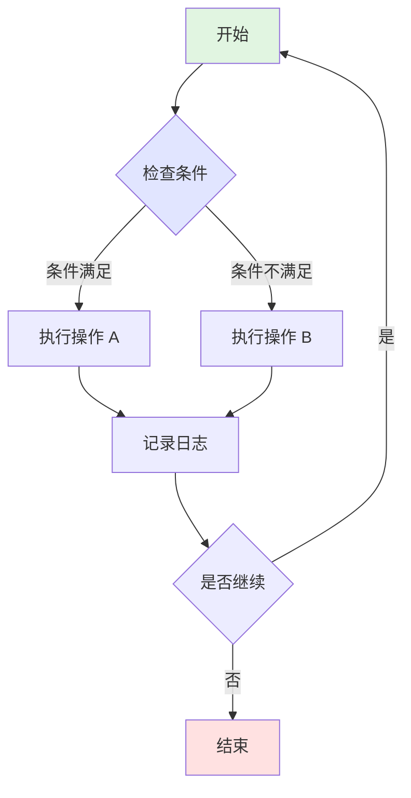

### 7.2 序列图

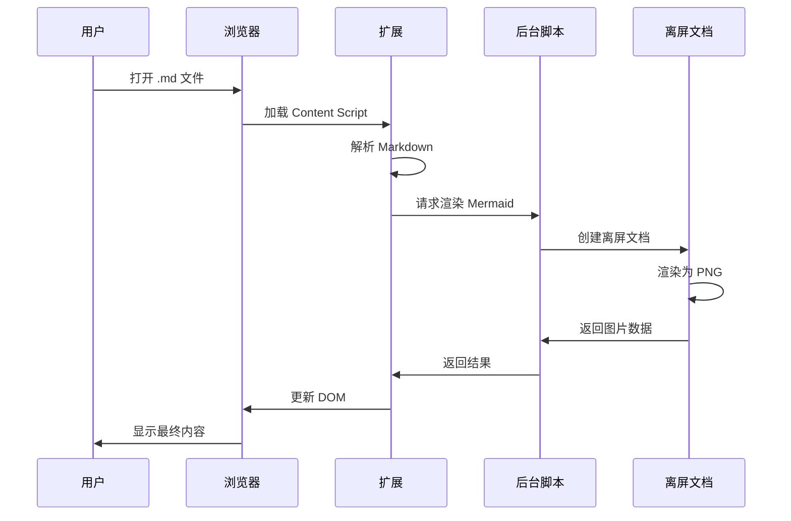

### 7.3 甘特图

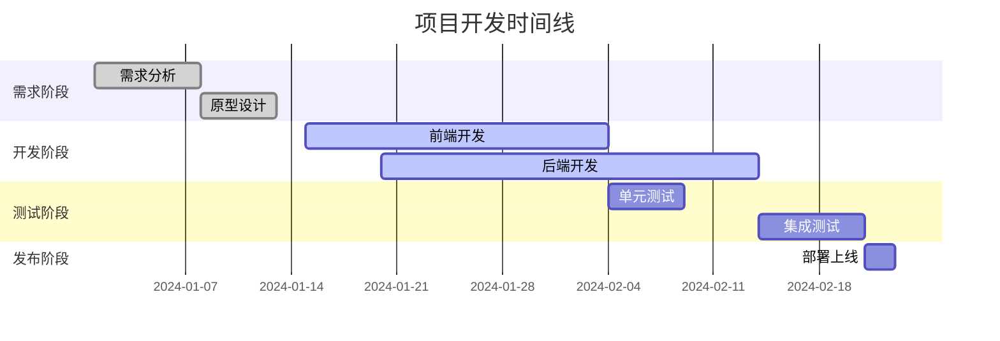

### 7.4 类图

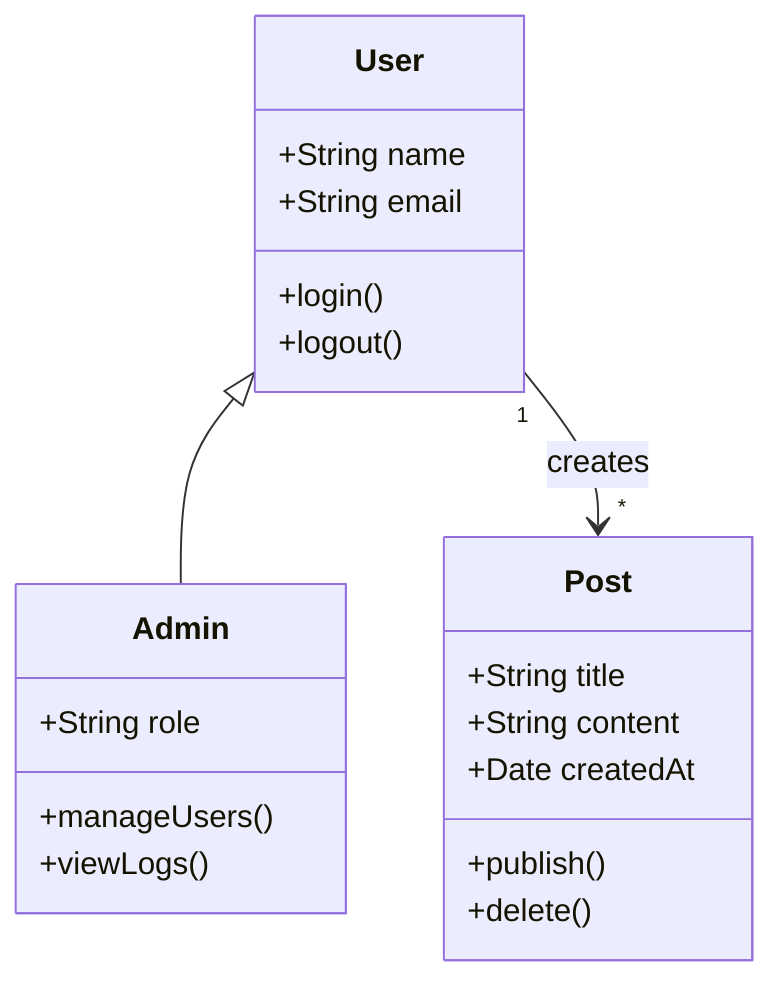

### 7.5 状态图

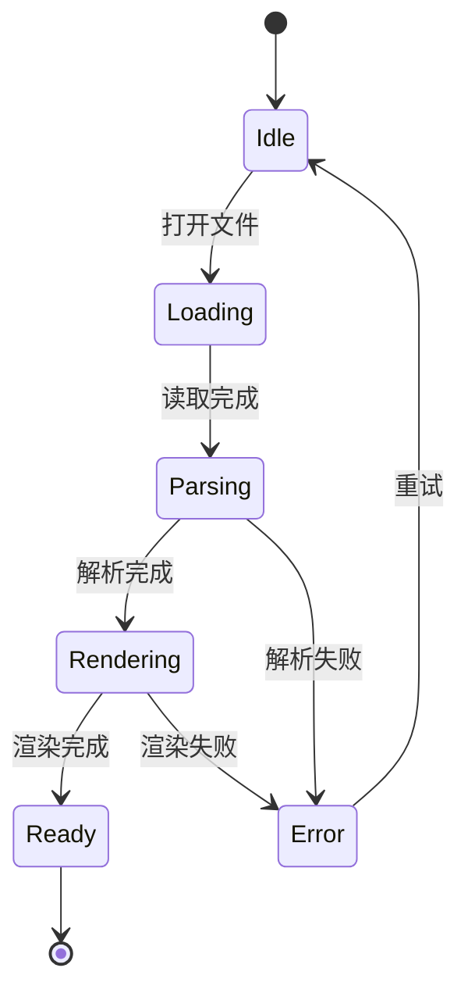

### 7.6 饼图

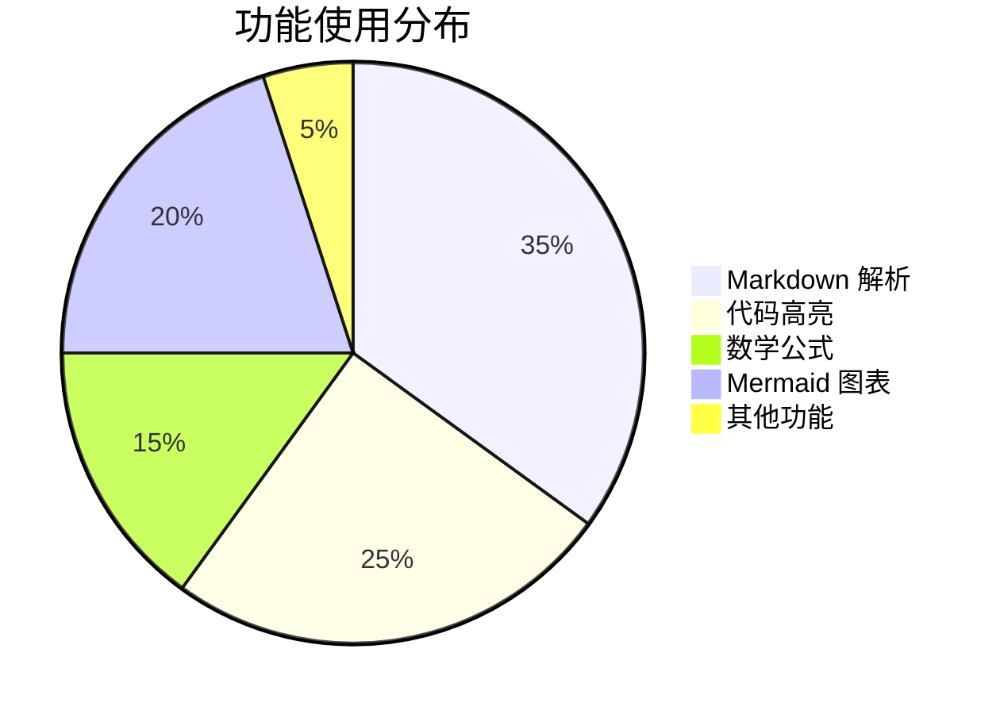

### 7.7 Graph 图（流程图）

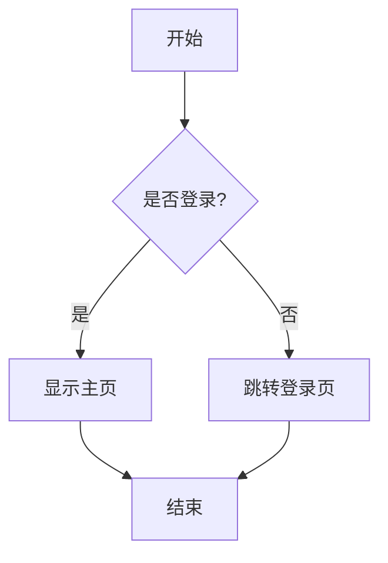

### foreignObject emoji 裁剪

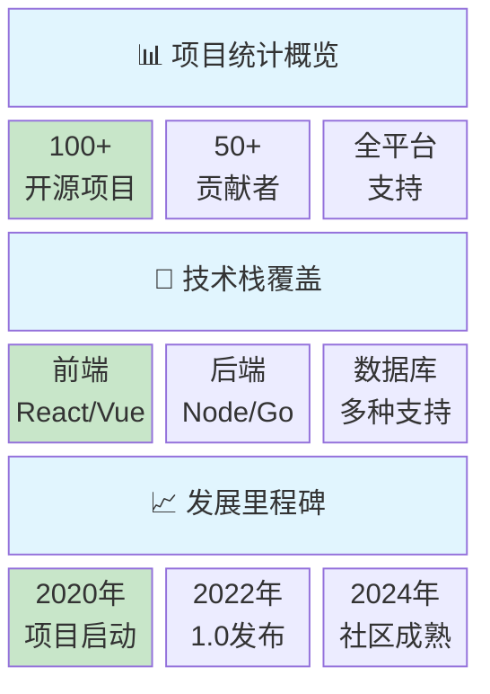

### 换行容错

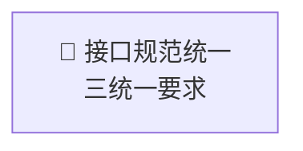

---

## 8. Vega-Lite 图表

### 8.1 简单柱状图

```vega-lite
{
  "$schema": "https://vega.github.io/schema/vega-lite/v5.json",
  "description": "A simple bar chart with embedded data.",
  "data": {
    "values": [
      {"category": "A", "value": 28},
      {"category": "B", "value": 55},
      {"category": "C", "value": 43},
      {"category": "D", "value": 91},
      {"category": "E", "value": 81},
      {"category": "F", "value": 53},
      {"category": "G", "value": 19},
      {"category": "H", "value": 87}
    ]
  },
  "mark": "bar",
  "encoding": {
    "x": {"field": "category", "type": "nominal", "axis": {"labelAngle": 0}},
    "y": {"field": "value", "type": "quantitative"}
  }
}
```

### 8.2 散点图

```vega-lite
{
  "$schema": "https://vega.github.io/schema/vega-lite/v5.json",
  "description": "A scatterplot showing horsepower and miles per gallon.",
  "data": {
    "values": [
      {"x": 10, "y": 20},
      {"x": 20, "y": 40},
      {"x": 30, "y": 25},
      {"x": 40, "y": 50},
      {"x": 50, "y": 45},
      {"x": 60, "y": 60}
    ]
  },
  "mark": "point",
  "encoding": {
    "x": {"field": "x", "type": "quantitative"},
    "y": {"field": "y", "type": "quantitative"},
    "size": {"value": 100},
    "color": {"value": "steelblue"}
  }
}
```

### 8.3 折线图

```vega-lite
{
  "$schema": "https://vega.github.io/schema/vega-lite/v5.json",
  "description": "A simple line chart.",
  "data": {
    "values": [
      {"month": "Jan", "sales": 100},
      {"month": "Feb", "sales": 150},
      {"month": "Mar", "sales": 120},
      {"month": "Apr", "sales": 180},
      {"month": "May", "sales": 200},
      {"month": "Jun", "sales": 170}
    ]
  },
  "mark": {
    "type": "line",
    "point": true
  },
  "encoding": {
    "x": {"field": "month", "type": "ordinal"},
    "y": {"field": "sales", "type": "quantitative"}
  }
}
```

### 8.4 饼图

```vega-lite
{
  "$schema": "https://vega.github.io/schema/vega-lite/v5.json",
  "description": "A simple pie chart.",
  "data": {
    "values": [
      {"category": "A", "value": 4},
      {"category": "B", "value": 6},
      {"category": "C", "value": 10},
      {"category": "D", "value": 3},
      {"category": "E", "value": 7}
    ]
  },
  "mark": "arc",
  "encoding": {
    "theta": {"field": "value", "type": "quantitative"},
    "color": {"field": "category", "type": "nominal"}
  },
  "view": {"stroke": null}
}
```

### 8.5 热力图

```vega-lite
{
  "$schema": "https://vega.github.io/schema/vega-lite/v5.json",
  "description": "A simple heatmap.",
  "data": {
    "values": [
      {"x": "A", "y": "1", "value": 10},
      {"x": "A", "y": "2", "value": 20},
      {"x": "A", "y": "3", "value": 15},
      {"x": "B", "y": "1", "value": 25},
      {"x": "B", "y": "2", "value": 30},
      {"x": "B", "y": "3", "value": 18},
      {"x": "C", "y": "1", "value": 12},
      {"x": "C", "y": "2", "value": 22},
      {"x": "C", "y": "3", "value": 28}
    ]
  },
  "mark": "rect",
  "encoding": {
    "x": {"field": "x", "type": "nominal"},
    "y": {"field": "y", "type": "nominal"},
    "color": {"field": "value", "type": "quantitative"}
  }
}
```

### 8.6 堆叠柱状图

```vega-lite
{
  "$schema": "https://vega.github.io/schema/vega-lite/v5.json",
  "description": "A stacked bar chart.",
  "data": {
    "values": [
      {"category": "A", "group": "x", "value": 10},
      {"category": "A", "group": "y", "value": 20},
      {"category": "A", "group": "z", "value": 15},
      {"category": "B", "group": "x", "value": 15},
      {"category": "B", "group": "y", "value": 25},
      {"category": "B", "group": "z", "value": 10},
      {"category": "C", "group": "x", "value": 20},
      {"category": "C", "group": "y", "value": 15},
      {"category": "C", "group": "z", "value": 25}
    ]
  },
  "mark": "bar",
  "encoding": {
    "x": {"field": "category", "type": "nominal"},
    "y": {"field": "value", "type": "quantitative"},
    "color": {"field": "group", "type": "nominal"}
  }
}
```

### 8.7 分组柱状图

```vega-lite
{
  "$schema": "https://vega.github.io/schema/vega-lite/v5.json",
  "description": "A grouped bar chart.",
  "data": {
    "values": [
      {"category": "A", "group": "x", "value": 28},
      {"category": "A", "group": "y", "value": 55},
      {"category": "B", "group": "x", "value": 43},
      {"category": "B", "group": "y", "value": 91},
      {"category": "C", "group": "x", "value": 81},
      {"category": "C", "group": "y", "value": 53}
    ]
  },
  "mark": "bar",
  "encoding": {
    "x": {"field": "group", "type": "nominal"},
    "y": {"field": "value", "type": "quantitative"},
    "color": {"field": "group", "type": "nominal"},
    "xOffset": {"field": "category"}
  }
}
```

### 8.8 面积图

```vega-lite
{
  "$schema": "https://vega.github.io/schema/vega-lite/v5.json",
  "description": "An area chart.",
  "data": {
    "values": [
      {"x": 1, "y": 10},
      {"x": 2, "y": 30},
      {"x": 3, "y": 20},
      {"x": 4, "y": 45},
      {"x": 5, "y": 35},
      {"x": 6, "y": 50}
    ]
  },
  "mark": "area",
  "encoding": {
    "x": {"field": "x", "type": "quantitative"},
    "y": {"field": "y", "type": "quantitative"}
  }
}
```

### 8.9 多系列折线图

```vega-lite
{
  "$schema": "https://vega.github.io/schema/vega-lite/v5.json",
  "description": "Multi-series line chart.",
  "data": {
    "values": [
      {"month": 1, "series": "A", "value": 28},
      {"month": 2, "series": "A", "value": 55},
      {"month": 3, "series": "A", "value": 43},
      {"month": 4, "series": "A", "value": 91},
      {"month": 1, "series": "B", "value": 35},
      {"month": 2, "series": "B", "value": 48},
      {"month": 3, "series": "B", "value": 52},
      {"month": 4, "series": "B", "value": 63}
    ]
  },
  "mark": "line",
  "encoding": {
    "x": {"field": "month", "type": "ordinal"},
    "y": {"field": "value", "type": "quantitative"},
    "color": {"field": "series", "type": "nominal"}
  }
}
```

### 8.10 箱线图

```vega-lite
{
  "$schema": "https://vega.github.io/schema/vega-lite/v5.json",
  "description": "A box plot.",
  "data": {
    "values": [
      {"group": "A", "value": 12},
      {"group": "A", "value": 23},
      {"group": "A", "value": 15},
      {"group": "A", "value": 28},
      {"group": "A", "value": 19},
      {"group": "A", "value": 35},
      {"group": "B", "value": 18},
      {"group": "B", "value": 25},
      {"group": "B", "value": 22},
      {"group": "B", "value": 31},
      {"group": "B", "value": 27},
      {"group": "B", "value": 40}
    ]
  },
  "mark": "boxplot",
  "encoding": {
    "x": {"field": "group", "type": "nominal"},
    "y": {"field": "value", "type": "quantitative"}
  }
}
```

### 8.11 带趋势线的散点图

```vega-lite
{
  "$schema": "https://vega.github.io/schema/vega-lite/v5.json",
  "description": "Scatter plot with a trend line.",
  "data": {
    "values": [
      {"x": 10, "y": 22},
      {"x": 20, "y": 38},
      {"x": 30, "y": 31},
      {"x": 40, "y": 52},
      {"x": 50, "y": 48},
      {"x": 60, "y": 65},
      {"x": 70, "y": 59},
      {"x": 80, "y": 78}
    ]
  },
  "layer": [
    {
      "mark": "point",
      "encoding": {
        "x": {"field": "x", "type": "quantitative"},
        "y": {"field": "y", "type": "quantitative"}
      }
    },
    {
      "mark": {
        "type": "line",
        "color": "firebrick"
      },
      "transform": [
        {
          "regression": "y",
          "on": "x"
        }
      ],
      "encoding": {
        "x": {"field": "x", "type": "quantitative"},
        "y": {"field": "y", "type": "quantitative"}
      }
    }
  ]
}
```

### 8.12 水平柱状图

```vega-lite
{
  "$schema": "https://vega.github.io/schema/vega-lite/v5.json",
  "description": "A horizontal bar chart.",
  "data": {
    "values": [
      {"category": "Alpha", "value": 28},
      {"category": "Beta", "value": 55},
      {"category": "Gamma", "value": 43},
      {"category": "Delta", "value": 91},
      {"category": "Epsilon", "value": 81}
    ]
  },
  "mark": "bar",
  "encoding": {
    "y": {"field": "category", "type": "nominal", "sort": "-x"},
    "x": {"field": "value", "type": "quantitative"}
  }
}
```

### 8.13 直方图

```vega-lite
{
  "$schema": "https://vega.github.io/schema/vega-lite/v5.json",
  "description": "A histogram showing distribution.",
  "data": {
    "values": [
      {"value": 12}, {"value": 15}, {"value": 18}, {"value": 22},
      {"value": 25}, {"value": 28}, {"value": 31}, {"value": 35},
      {"value": 38}, {"value": 42}, {"value": 45}, {"value": 48},
      {"value": 52}, {"value": 55}, {"value": 58}, {"value": 62},
      {"value": 65}, {"value": 68}, {"value": 72}, {"value": 75}
    ]
  },
  "mark": "bar",
  "encoding": {
    "x": {
      "bin": {"maxbins": 10},
      "field": "value",
      "type": "quantitative"
    },
    "y": {
      "aggregate": "count",
      "type": "quantitative"
    }
  }
}
```

### 8.14 甜甜圈图

```vega-lite
{
  "$schema": "https://vega.github.io/schema/vega-lite/v5.json",
  "description": "A donut chart.",
  "data": {
    "values": [
      {"category": "A", "value": 30},
      {"category": "B", "value": 45},
      {"category": "C", "value": 25}
    ]
  },
  "mark": {"type": "arc", "innerRadius": 50},
  "encoding": {
    "theta": {"field": "value", "type": "quantitative"},
    "color": {"field": "category", "type": "nominal"}
  }
}
```

---

### 8.15 中文数据可视化示例（包含较多中文文字）

#### 8.15.1 产品销售分析柱状图

```vega-lite
{
  "$schema": "https://vega.github.io/schema/vega-lite/v5.json",
  "title": {
    "text": "2024年第三季度各地区智能手机销售额统计",
    "fontSize": 18,
    "anchor": "middle"
  },
  "description": "展示不同地区的产品销售情况",
  "data": {
    "values": [
      {"地区": "华北地区", "销售额": 285000, "产品类别": "旗舰机型"},
      {"地区": "华东地区", "销售额": 456000, "产品类别": "旗舰机型"},
      {"地区": "华南地区", "销售额": 398000, "产品类别": "旗舰机型"},
      {"地区": "西南地区", "销售额": 267000, "产品类别": "旗舰机型"},
      {"地区": "东北地区", "销售额": 189000, "产品类别": "旗舰机型"},
      {"地区": "西北地区", "销售额": 145000, "产品类别": "旗舰机型"},
      {"地区": "华北地区", "销售额": 156000, "产品类别": "中端机型"},
      {"地区": "华东地区", "销售额": 245000, "产品类别": "中端机型"},
      {"地区": "华南地区", "销售额": 218000, "产品类别": "中端机型"},
      {"地区": "西南地区", "销售额": 134000, "产品类别": "中端机型"},
      {"地区": "东北地区", "销售额": 98000, "产品类别": "中端机型"},
      {"地区": "西北地区", "销售额": 76000, "产品类别": "中端机型"}
    ]
  },
  "mark": "bar",
  "encoding": {
    "x": {
      "field": "地区",
      "type": "nominal",
      "axis": {
        "labelAngle": -45,
        "labelFontSize": 12,
        "title": "销售地区",
        "titleFontSize": 14
      }
    },
    "y": {
      "field": "销售额",
      "type": "quantitative",
      "axis": {
        "labelFontSize": 11,
        "title": "销售额（人民币/元）",
        "titleFontSize": 14
      }
    },
    "color": {
      "field": "产品类别",
      "type": "nominal",
      "scale": {
        "domain": ["旗舰机型", "中端机型"],
        "range": ["#3b82f6", "#10b981"]
      },
      "legend": {
        "title": "产品类别",
        "titleFontSize": 13,
        "labelFontSize": 11
      }
    },
    "xOffset": {"field": "产品类别"}
  },
  "width": 600,
  "height": 350
}
```

#### 8.15.2 教育数据多系列折线图

```vega-lite
{
  "$schema": "https://vega.github.io/schema/vega-lite/v5.json",
  "title": {
    "text": "各学科平均成绩趋势分析（2020-2024学年）",
    "fontSize": 18
  },
  "description": "学生学科成绩变化趋势",
  "data": {
    "values": [
      {"学年": "2020学年", "学科": "语文", "平均分": 78.5},
      {"学年": "2021学年", "学科": "语文", "平均分": 81.2},
      {"学年": "2022学年", "学科": "语文", "平均分": 83.8},
      {"学年": "2023学年", "学科": "语文", "平均分": 85.3},
      {"学年": "2024学年", "学科": "语文", "平均分": 87.1},
      {"学年": "2020学年", "学科": "数学", "平均分": 82.3},
      {"学年": "2021学年", "学科": "数学", "平均分": 84.7},
      {"学年": "2022学年", "学科": "数学", "平均分": 86.2},
      {"学年": "2023学年", "学科": "数学", "平均分": 88.5},
      {"学年": "2024学年", "学科": "数学", "平均分": 90.2},
      {"学年": "2020学年", "学科": "英语", "平均分": 75.8},
      {"学年": "2021学年", "学科": "英语", "平均分": 77.9},
      {"学年": "2022学年", "学科": "英语", "平均分": 80.4},
      {"学年": "2023学年", "学科": "英语", "平均分": 82.6},
      {"学年": "2024学年", "学科": "英语", "平均分": 84.8},
      {"学年": "2020学年", "学科": "物理", "平均分": 71.2},
      {"学年": "2021学年", "学科": "物理", "平均分": 73.5},
      {"学年": "2022学年", "学科": "物理", "平均分": 76.1},
      {"学年": "2023学年", "学科": "物理", "平均分": 78.9},
      {"学年": "2024学年", "学科": "物理", "平均分": 81.3},
      {"学年": "2020学年", "学科": "化学", "平均分": 73.6},
      {"学年": "2021学年", "学科": "化学", "平均分": 75.8},
      {"学年": "2022学年", "学科": "化学", "平均分": 78.2},
      {"学年": "2023学年", "学科": "化学", "平均分": 80.7},
      {"学年": "2024学年", "学科": "化学", "平均分": 83.1}
    ]
  },
  "mark": {
    "type": "line",
    "point": true
  },
  "encoding": {
    "x": {
      "field": "学年",
      "type": "ordinal",
      "axis": {
        "labelAngle": -30,
        "labelFontSize": 11,
        "title": "学年",
        "titleFontSize": 14
      }
    },
    "y": {
      "field": "平均分",
      "type": "quantitative",
      "scale": {"domain": [65, 95]},
      "axis": {
        "labelFontSize": 11,
        "title": "平均分数",
        "titleFontSize": 14
      }
    },
    "color": {
      "field": "学科",
      "type": "nominal",
      "scale": {
        "domain": ["语文", "数学", "英语", "物理", "化学"],
        "range": ["#ef4444", "#3b82f6", "#10b981", "#f59e0b", "#8b5cf6"]
      },
      "legend": {
        "title": "学科类别",
        "titleFontSize": 13,
        "labelFontSize": 11
      }
    }
  },
  "width": 600,
  "height": 350
}
```

#### 8.15.3 城市人口分布饼图

```vega-lite
{
  "$schema": "https://vega.github.io/schema/vega-lite/v5.json",
  "title": {
    "text": "中国主要城市群人口分布情况（2024年统计数据）",
    "fontSize": 18
  },
  "description": "展示不同城市群的人口占比",
  "data": {
    "values": [
      {"城市群": "京津冀城市群", "人口": 11200, "备注": "包括北京、天津、河北等地区"},
      {"城市群": "长三角城市群", "人口": 23500, "备注": "包括上海、江苏、浙江等地区"},
      {"城市群": "珠三角城市群", "人口": 8600, "备注": "包括广州、深圳等地区"},
      {"城市群": "成渝城市群", "人口": 9700, "备注": "包括成都、重庆等地区"},
      {"城市群": "长江中游城市群", "人口": 12800, "备注": "包括武汉、长沙、南昌等地区"},
      {"城市群": "中原城市群", "人口": 16700, "备注": "包括郑州等中原地区"},
      {"城市群": "关中平原城市群", "人口": 5400, "备注": "包括西安等地区"},
      {"城市群": "其他地区", "人口": 32100, "备注": "其他省市地区"}
    ]
  },
  "mark": {"type": "arc", "innerRadius": 60, "tooltip": true},
  "encoding": {
    "theta": {
      "field": "人口",
      "type": "quantitative"
    },
    "color": {
      "field": "城市群",
      "type": "nominal",
      "scale": {
        "domain": [
          "京津冀城市群",
          "长三角城市群",
          "珠三角城市群",
          "成渝城市群",
          "长江中游城市群",
          "中原城市群",
          "关中平原城市群",
          "其他地区"
        ],
        "range": [
          "#3b82f6",
          "#10b981",
          "#f59e0b",
          "#ef4444",
          "#8b5cf6",
          "#06b6d4",
          "#ec4899",
          "#94a3b8"
        ]
      },
      "legend": {
        "title": "城市群名称",
        "titleFontSize": 13,
        "labelFontSize": 11,
        "orient": "right"
      }
    },
    "tooltip": [
      {"field": "城市群", "type": "nominal", "title": "城市群"},
      {"field": "人口", "type": "quantitative", "title": "人口（万人）"},
      {"field": "备注", "type": "nominal", "title": "说明"}
    ]
  },
  "view": {"stroke": null},
  "width": 400,
  "height": 400
}
```

#### 8.15.4 企业员工部门分布堆叠柱状图

```vega-lite
{
  "$schema": "https://vega.github.io/schema/vega-lite/v5.json",
  "title": {
    "text": "科技公司各部门员工学历分布统计",
    "fontSize": 18
  },
  "description": "展示不同部门员工的学历构成",
  "data": {
    "values": [
      {"部门": "技术研发部", "学历": "博士", "人数": 45},
      {"部门": "技术研发部", "学历": "硕士", "人数": 156},
      {"部门": "技术研发部", "学历": "本科", "人数": 234},
      {"部门": "技术研发部", "学历": "专科", "人数": 32},
      {"部门": "产品设计部", "学历": "博士", "人数": 12},
      {"部门": "产品设计部", "学历": "硕士", "人数": 67},
      {"部门": "产品设计部", "学历": "本科", "人数": 98},
      {"部门": "产品设计部", "学历": "专科", "人数": 23},
      {"部门": "市场营销部", "学历": "博士", "人数": 5},
      {"部门": "市场营销部", "学历": "硕士", "人数": 43},
      {"部门": "市场营销部", "学历": "本科", "人数": 87},
      {"部门": "市场营销部", "学历": "专科", "人数": 34},
      {"部门": "人力资源部", "学历": "博士", "人数": 3},
      {"部门": "人力资源部", "学历": "硕士", "人数": 28},
      {"部门": "人力资源部", "学历": "本科", "人数": 52},
      {"部门": "人力资源部", "学历": "专科", "人数": 18},
      {"部门": "财务管理部", "学历": "博士", "人数": 2},
      {"部门": "财务管理部", "学历": "硕士", "人数": 35},
      {"部门": "财务管理部", "学历": "本科", "人数": 48},
      {"部门": "财务管理部", "学历": "专科", "人数": 15}
    ]
  },
  "mark": "bar",
  "encoding": {
    "x": {
      "field": "部门",
      "type": "nominal",
      "axis": {
        "labelAngle": -45,
        "labelFontSize": 11,
        "title": "部门名称",
        "titleFontSize": 14
      }
    },
    "y": {
      "field": "人数",
      "type": "quantitative",
      "axis": {
        "labelFontSize": 11,
        "title": "员工人数",
        "titleFontSize": 14
      }
    },
    "color": {
      "field": "学历",
      "type": "nominal",
      "scale": {
        "domain": ["博士", "硕士", "本科", "专科"],
        "range": ["#8b5cf6", "#3b82f6", "#10b981", "#f59e0b"]
      },
      "legend": {
        "title": "学历类别",
        "titleFontSize": 13,
        "labelFontSize": 11
      }
    }
  },
  "width": 500,
  "height": 350
}
```

#### 8.15.5 气温变化面积图

```vega-lite
{
  "$schema": "https://vega.github.io/schema/vega-lite/v5.json",
  "title": {
    "text": "北京市2024年全年气温变化趋势（月度统计）",
    "fontSize": 18
  },
  "description": "展示全年气温变化情况",
  "data": {
    "values": [
      {"月份": "1月", "最高温": 5, "平均温": -2, "最低温": -8, "季节": "冬季"},
      {"月份": "2月", "最高温": 8, "平均温": 1, "最低温": -5, "季节": "冬季"},
      {"月份": "3月", "最高温": 15, "平均温": 8, "最低温": 2, "季节": "春季"},
      {"月份": "4月", "最高温": 22, "平均温": 15, "最低温": 9, "季节": "春季"},
      {"月份": "5月", "最高温": 28, "平均温": 21, "最低温": 15, "季节": "春季"},
      {"月份": "6月", "最高温": 32, "平均温": 26, "最低温": 20, "季节": "夏季"},
      {"月份": "7月", "最高温": 34, "平均温": 28, "最低温": 23, "季节": "夏季"},
      {"月份": "8月", "最高温": 33, "平均温": 27, "最低温": 22, "季节": "夏季"},
      {"月份": "9月", "最高温": 28, "平均温": 22, "最低温": 16, "季节": "秋季"},
      {"月份": "10月", "最高温": 21, "平均温": 14, "最低温": 8, "季节": "秋季"},
      {"月份": "11月", "最高温": 12, "平均温": 5, "最低温": -1, "季节": "秋季"},
      {"月份": "12月", "最高温": 6, "平均温": -1, "最低温": -7, "季节": "冬季"}
    ]
  },
  "mark": {"type": "area", "line": true, "point": true},
  "encoding": {
    "x": {
      "field": "月份",
      "type": "ordinal",
      "sort": null,
      "axis": {
        "labelAngle": 0,
        "labelFontSize": 11,
        "title": "月份",
        "titleFontSize": 14
      }
    },
    "y": {
      "field": "平均温",
      "type": "quantitative",
      "axis": {
        "labelFontSize": 11,
        "title": "平均温度（摄氏度）",
        "titleFontSize": 14
      }
    },
    "color": {"value": "#3b82f6"},
    "opacity": {"value": 0.6}
  },
  "width": 600,
  "height": 300
}
```

---

## 9. DOT 图表 (Graphviz)

### 9.1 简单有向图

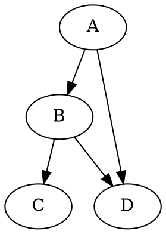

### 9.2 带样式的有向图

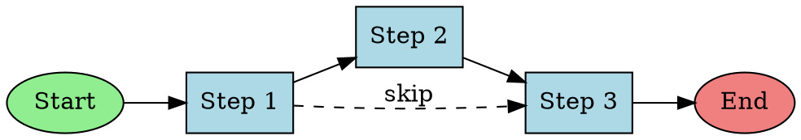

### 9.3 无向图

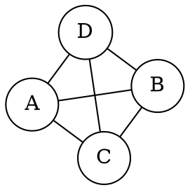

### 9.4 子图和集群

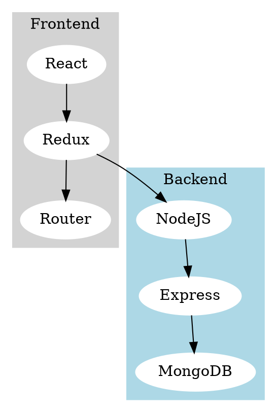

### 9.5 状态机图

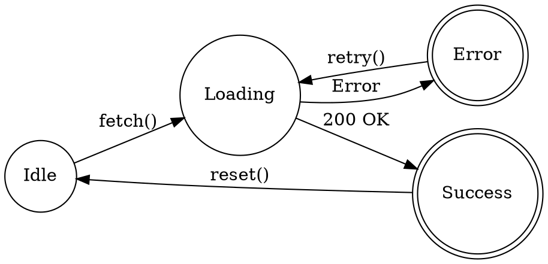

### 9.6 记录节点（表格样式）

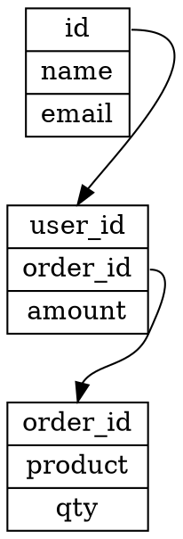

---

## 10. 图片处理

### 10.1 SVG 文件测试

**本地 SVG 文件：**


### 10.2 Data URL SVG 测试

**Base64 编码格式：**


**URL 编码格式：**


**复杂 Data URL SVG：**


### 10.3 内联 SVG 测试

这是文本中的小图标  应该内联显示。

测试多个小图标：  

**混合文本：**
操作成功时显示  图标，点击  展开详情，查看  获取帮助。

---

## 11. HTML 混合内容

### 11.1 简单 HTML 元素

<div style="padding: 15px; background: #f0f9ff; border-left: 4px solid #0284c7; margin: 10px 0;">
  <strong>💡 提示：</strong>这是一个使用 HTML 编写的提示框，测试 HTML 和 Markdown 混合使用。
</div>

<div style="display: flex; gap: 10px; margin: 20px 0;">
  <div style="flex: 1; padding: 15px; background: #dcfce7; border-radius: 8px;">
    <h4 style="margin: 0 0 8px 0; color: #166534;">✅ 成功</h4>
    <p style="margin: 0; font-size: 14px;">操作已成功完成</p>
  </div>
  <div style="flex: 1; padding: 15px; background: #fee2e2; border-radius: 8px;">
    <h4 style="margin: 0 0 8px 0; color: #991b1b;">❌ 错误</h4>
    <p style="margin: 0; font-size: 14px;">发生了一个错误</p>
  </div>
</div>

**html注释**
<!-- 这是一个 html 注释 -->

### 11.2 复杂布局示例

<div style="background: linear-gradient(135deg, #667eea 0%, #764ba2 100%); color: white; padding: 30px; border-radius: 12px; margin: 20px 0;">
  <h3 style="margin: 0 0 15px 0;">扩展功能特性</h3>
  <div style="display: grid; grid-template-columns: repeat(auto-fit, minmax(200px, 1fr)); gap: 15px;">
    <div style="background: rgba(255,255,255,0.1); padding: 15px; border-radius: 8px;">
      <strong>⚡ 高性能</strong><br/>
      双层缓存架构
    </div>
    <div style="background: rgba(255,255,255,0.1); padding: 15px; border-radius: 8px;">
      <strong>🎨 美观</strong><br/>
      现代化UI设计
    </div>
    <div style="background: rgba(255,255,255,0.1); padding: 15px; border-radius: 8px;">
      <strong>🔒 安全</strong><br/>
      Manifest V3
    </div>
  </div>
</div>

### 11.3 数据展示

<table style="border-collapse: collapse; margin: 20px 0;">
  <thead>
    <tr style="background: #f3f4f6;">
      <th style="padding: 12px; text-align: left; border: 1px solid #e5e7eb;">模块</th>
      <th style="padding: 12px; text-align: left; border: 1px solid #e5e7eb;">功能</th>
      <th style="padding: 12px; text-align: center; border: 1px solid #e5e7eb;">状态</th>
    </tr>
  </thead>
  <tbody>
    <tr>
      <td style="padding: 12px; border: 1px solid #e5e7eb;">Content Script</td>
      <td style="padding: 12px; border: 1px solid #e5e7eb;">Markdown 渲染</td>
      <td style="padding: 12px; text-align: center; border: 1px solid #e5e7eb;">✅</td>
    </tr>
    <tr style="background: #f9fafb;">
      <td style="padding: 12px; border: 1px solid #e5e7eb;">Offscreen Document</td>
      <td style="padding: 12px; border: 1px solid #e5e7eb;">图表转换</td>
      <td style="padding: 12px; text-align: center; border: 1px solid #e5e7eb;">✅</td>
    </tr>
    <tr>
      <td style="padding: 12px; border: 1px solid #e5e7eb;">Cache Manager</td>
      <td style="padding: 12px; border: 1px solid #e5e7eb;">性能优化</td>
      <td style="padding: 12px; text-align: center; border: 1px solid #e5e7eb;">✅</td>
    </tr>
  </tbody>
</table>

### 11.4 扩展整体架构图


<div style="width: 1280px; box-sizing: border-box; position: relative;">
  <style scoped>
    .ext-arch-container { display: flex; gap: 15px; }
    .ext-wing-left { width: 200px; flex-shrink: 0; }
    .ext-wing-right { width: 200px; flex-shrink: 0; }
    .ext-arch-main { flex: 1; min-width: 0; }
    .ext-arch-title { text-align: center; font-size: 24px; font-weight: bold; color: #1e3a8a; margin-bottom: 20px; }
    .ext-arch-layer { margin: 10px 0; padding: 15px; border-radius: 10px; position: relative; }
    .ext-arch-divider { display: flex; align-items: center; justify-content: center; margin: 8px 0; color: #64748b; font-size: 13px; font-style: italic; }
    .ext-arch-divider-line { flex: 1; height: 1px; background: #cbd5e1; }
    .ext-arch-divider-text { margin: 0 15px; }
    .ext-layer-user { background: linear-gradient(135deg, #fef3c7 0%, #fde68a 100%); border: 2px solid #f59e0b; }
    .ext-layer-extension { background: linear-gradient(135deg, #eff6ff 0%, #dbeafe 100%); border: 2px solid #2563eb; }
    .ext-layer-processing { background: linear-gradient(135deg, #e0f2fe 0%, #bae6fd 100%); border: 2px solid #0284c7; }
    .ext-layer-storage { background: linear-gradient(135deg, #f0fdf4 0%, #dcfce7 100%); border: 2px solid #10b981; }
    .ext-section-header { font-size: 16px; font-weight: bold; color: #334155; margin-bottom: 15px; text-align: center; }
    .ext-user-grid { display: grid; grid-template-columns: repeat(3, 1fr); gap: 15px; }
    .ext-extension-grid { display: grid; grid-template-columns: repeat(5, 1fr); gap: 12px; }
    .ext-processing-grid { display: grid; grid-template-columns: repeat(4, 1fr); gap: 12px; }
    .ext-storage-grid { display: grid; grid-template-columns: repeat(2, 1fr); gap: 15px; }
    .ext-component-box { border-radius: 8px; padding: 12px; text-align: center; box-shadow: 0 2px 4px rgba(0,0,0,0.1); }
    .ext-user-box { background: #fbbf24; border: 1.5px solid #d97706; }
    .ext-extension-box { background: #60a5fa; border: 1.5px solid #2563eb; }
    .ext-processing-box { background: #38bdf8; border: 1.5px solid #0284c7; }
    .ext-storage-box { background: #4ade80; border: 1.5px solid #16a34a; }
    .ext-component-title { font-size: 13px; font-weight: bold; color: #1e3a8a; margin-bottom: 8px; }
    .ext-component-text { font-size: 12px; color: #1e40af; line-height: 1.5; }
    .ext-component-feature { background: rgba(255,255,255,0.7); border-radius: 4px; padding: 4px; margin: 3px 0; font-size: 11px; }
    .ext-wing-panel { background: linear-gradient(135deg, #f3e8ff 0%, #e9d5ff 100%); border: 2px solid #7c3aed; border-radius: 8px; padding: 12px 12px 15px 12px; }
    .ext-wing-panel.external { background: linear-gradient(135deg, #fdf4ff 0%, #fae8ff 100%); border-color: #a855f7; }
    .ext-wing-header { font-size: 16px; font-weight: bold; text-align: center; margin-bottom: 15px; color: #581c87; }
    .ext-wing-header.external { color: #7e22ce; }
    .ext-wing-section { background: #8b5cf6; border: 1.5px solid #7c3aed; border-radius: 6px; padding: 10px; margin: 10px 0; }
    .ext-wing-section.external { background: #a855f7; border-color: #9333ea; }
    .ext-wing-section-title { font-size: 13px; font-weight: bold; color: #f3f4f6; margin-bottom: 8px; text-align: center; }
    .ext-wing-text { font-size: 11px; color: #f3f4f6; line-height: 1.4; text-align: center; }
    .ext-wing-item { background: rgba(255,255,255,0.2); border-radius: 4px; padding: 4px 6px; margin: 3px 0; font-size: 11px; }
  </style>
  <div class="ext-arch-title">Markdown Viewer Extension 整体架构</div>
  <div class="ext-arch-divider"><div class="ext-arch-divider-line"></div></div>
  <div class="ext-arch-container">
    <!-- Left Wing: Core Technologies -->
    <div class="ext-wing-left">
      <div class="ext-wing-panel">
        <div class="ext-wing-header">核心技术栈</div>
        <div class="ext-wing-section">
          <div class="ext-wing-section-title">Markdown处理</div>
          <div class="ext-wing-text">
            <div class="ext-wing-item">unified核心引擎</div>
            <div class="ext-wing-item">remark-parse解析器</div>
            <div class="ext-wing-item">remark-gfm扩展</div>
            <div class="ext-wing-item">remark-math公式</div>
            <div class="ext-wing-item">remark-rehype转换</div>
            <div class="ext-wing-item">unist-util-visit遍历</div>
          </div>
        </div>
        <div class="ext-wing-section">
          <div class="ext-wing-section-title">内容渲染</div>
          <div class="ext-wing-text">
            <div class="ext-wing-item">rehype-highlight语法高亮</div>
            <div class="ext-wing-item">rehype-katex数学渲染</div>
            <div class="ext-wing-item">rehype-stringify输出</div>
            <div class="ext-wing-item">rehype-slug锚点</div>
          </div>
        </div>
        <div class="ext-wing-section">
          <div class="ext-wing-section-title">安全机制</div>
          <div class="ext-wing-text">
            <div class="ext-wing-item">Manifest V3规范</div>
            <div class="ext-wing-item">动态脚本注入</div>
            <div class="ext-wing-item">chrome.scripting API</div>
            <div class="ext-wing-item">权限最小化</div>
          </div>
        </div>
      </div>
    </div>
    <!-- Main Architecture -->
    <div class="ext-arch-main">
      <!-- User Layer -->
      <div class="ext-arch-layer ext-layer-user">
        <div class="ext-section-header">用户交互层</div>
        <div class="ext-user-grid">
          <div class="ext-component-box ext-user-box">
            <div class="ext-component-title">用户</div>
            <div class="ext-component-text">
              <div class="ext-component-feature">文档查看</div>
              <div class="ext-component-feature">快捷键操作</div>
              <div class="ext-component-feature">目录导航</div>
            </div>
          </div>
          <div class="ext-component-box ext-user-box">
            <div class="ext-component-title">Chrome浏览器</div>
            <div class="ext-component-text">
              <div class="ext-component-feature">文件加载</div>
              <div class="ext-component-feature">扩展宿主</div>
              <div class="ext-component-feature">渲染引擎</div>
            </div>
          </div>
          <div class="ext-component-box ext-user-box">
            <div class="ext-component-title">文件系统</div>
            <div class="ext-component-text">
              <div class="ext-component-feature">本地.md文件</div>
              <div class="ext-component-feature">网络资源</div>
              <div class="ext-component-feature">相对路径</div>
            </div>
          </div>
        </div>
      </div>
        <div class="ext-arch-divider">
        <div class="ext-arch-divider-line"></div>
        <div class="ext-arch-divider-text">⬇ 自动检测激活</div>
        <div class="ext-arch-divider-line"></div>
      </div>
        <!-- Extension Layer -->
      <div class="ext-arch-layer ext-layer-extension">
        <div class="ext-section-header">Chrome扩展层</div>
        <div class="ext-extension-grid">
          <div class="ext-component-box ext-extension-box">
            <div class="ext-component-title">Content Detector</div>
            <div class="ext-component-text">
              <div class="ext-component-feature">轻量级检测脚本</div>
              <div class="ext-component-feature">文件扩展名检测</div>
              <div class="ext-component-feature">动态注入触发</div>
              <div class="ext-component-feature">.md/.markdown</div>
            </div>
          </div>
          <div class="ext-component-box ext-extension-box">
            <div class="ext-component-title">Content Script</div>
            <div class="ext-component-text">
              <div class="ext-component-feature">unified处理管道</div>
              <div class="ext-component-feature">DOM重构渲染</div>
              <div class="ext-component-feature">TOC目录生成</div>
              <div class="ext-component-feature">响应式布局</div>
            </div>
          </div>
          <div class="ext-component-box ext-extension-box">
            <div class="ext-component-title">Background Script</div>
            <div class="ext-component-text">
              <div class="ext-component-feature">消息中转代理</div>
              <div class="ext-component-feature">离屏文档管理</div>
              <div class="ext-component-feature">缓存操作代理</div>
              <div class="ext-component-feature">CSS/JS动态注入</div>
            </div>
          </div>
          <div class="ext-component-box ext-extension-box">
            <div class="ext-component-title">Popup UI</div>
            <div class="ext-component-text">
              <div class="ext-component-feature">缓存统计展示</div>
              <div class="ext-component-feature">清理操作界面</div>
              <div class="ext-component-feature">后台代理通信</div>
              <div class="ext-component-feature">状态监控</div>
            </div>
          </div>
          <div class="ext-component-box ext-extension-box">
            <div class="ext-component-title">Offscreen Document</div>
            <div class="ext-component-text">
              <div class="ext-component-feature">Mermaid图表渲染</div>
              <div class="ext-component-feature">SVG→PNG转换</div>
              <div class="ext-component-feature">html2canvas引擎</div>
              <div class="ext-component-feature">DOM_SCRAPING权限</div>
            </div>
          </div>
        </div>
      </div>
      <div class="ext-arch-divider">
        <div class="ext-arch-divider-line"></div>
        <div class="ext-arch-divider-text">⬇ 内容处理管道</div>
        <div class="ext-arch-divider-line"></div>
      </div>
      <!-- Processing Layer -->
      <div class="ext-arch-layer ext-layer-processing">
        <div class="ext-section-header">内容处理层</div>
        <div class="ext-processing-grid">
          <div class="ext-component-box ext-processing-box">
            <div class="ext-component-title">Markdown解析</div>
            <div class="ext-component-text">
              <div class="ext-component-feature">AST语法树</div>
              <div class="ext-component-feature">GFM扩展</div>
              <div class="ext-component-feature">数学公式</div>
              <div class="ext-component-feature">列表规范化</div>
            </div>
          </div>
          <div class="ext-component-box ext-processing-box">
            <div class="ext-component-title">代码语法高亮</div>
            <div class="ext-component-text">
              <div class="ext-component-feature">highlight.js</div>
              <div class="ext-component-feature">多语言支持</div>
              <div class="ext-component-feature">GitHub主题</div>
              <div class="ext-component-feature">自动识别</div>
            </div>
          </div>
          <div class="ext-component-box ext-processing-box">
            <div class="ext-component-title">图表渲染</div>
            <div class="ext-component-text">
              <div class="ext-component-feature">Mermaid→PNG</div>
              <div class="ext-component-feature">SVG→PNG</div>
              <div class="ext-component-feature">HTML→图片</div>
              <div class="ext-component-feature">离屏转换</div>
            </div>
          </div>
          <div class="ext-component-box ext-processing-box">
            <div class="ext-component-title">数学渲染</div>
            <div class="ext-component-text">
              <div class="ext-component-feature">KaTeX引擎</div>
              <div class="ext-component-feature">行内公式</div>
              <div class="ext-component-feature">块级公式</div>
              <div class="ext-component-feature">LaTeX语法</div>
            </div>
          </div>
        </div>
      </div>
      <div class="ext-arch-divider">
        <div class="ext-arch-divider-line"></div>
        <div class="ext-arch-divider-text">⬇ 缓存优化</div>
        <div class="ext-arch-divider-line"></div>
      </div>
      <!-- Storage Layer -->
      <div class="ext-arch-layer ext-layer-storage">
        <div class="ext-section-header">存储缓存层</div>
        <div class="ext-storage-grid">
          <div class="ext-component-box ext-storage-box">
            <div class="ext-component-title">Cache Manager</div>
            <div class="ext-component-text">
              <div class="ext-component-feature">双层缓存架构(L1+L2)</div>
              <div class="ext-component-feature">内存LRU缓存(100项)</div>
              <div class="ext-component-feature">IndexedDB持久化</div>
              <div class="ext-component-feature">SHA-256哈希键</div>
              <div class="ext-component-feature">自动淘汰机制</div>
              <div class="ext-component-feature">后台代理模式</div>
            </div>
          </div>
          <div class="ext-component-box ext-storage-box">
            <div class="ext-component-title">IndexedDB</div>
            <div class="ext-component-text">
              <div class="ext-component-feature">renderCache对象存储</div>
              <div class="ext-component-feature">多索引支持</div>
              <div class="ext-component-feature">时间戳/访问时间索引</div>
              <div class="ext-component-feature">大小/类型索引</div>
              <div class="ext-component-feature">事务安全操作</div>
              <div class="ext-component-feature">版本自动升级</div>
            </div>
          </div>
        </div>
      </div>
    </div>
    <!-- Right Wing: External Dependencies -->
    <div class="ext-wing-right">
      <div class="ext-wing-panel external">
        <div class="ext-wing-header external">外部依赖</div>
        <div class="ext-wing-section external">
          <div class="ext-wing-section-title">语法高亮</div>
          <div class="ext-wing-text">
            <div class="ext-wing-item">highlight.js</div>
            <div class="ext-wing-item">GitHub样式</div>
          </div>
        </div>
        <div class="ext-wing-section external">
          <div class="ext-wing-section-title">数学渲染</div>
          <div class="ext-wing-text">
            <div class="ext-wing-item">KaTeX</div>
            <div class="ext-wing-item">字体资源</div>
          </div>
        </div>
        <div class="ext-wing-section external">
          <div class="ext-wing-section-title">图表生成</div>
          <div class="ext-wing-text">
            <div class="ext-wing-item">Mermaid v11.12.1</div>
            <div class="ext-wing-item">html2canvas v1.4.1</div>
            <div class="ext-wing-item">DOM渲染引擎</div>
          </div>
        </div>
        <div class="ext-wing-section external">
          <div class="ext-wing-section-title">构建工具</div>
          <div class="ext-wing-text">
            <div class="ext-wing-item">esbuild v0.25.11</div>
            <div class="ext-wing-item">FibJS构建脚本</div>
            <div class="ext-wing-item">模块打包优化</div>
          </div>
        </div>
        <div class="ext-wing-section external">
          <div class="ext-wing-section-title">Chrome平台</div>
          <div class="ext-wing-text">
            <div class="ext-wing-item">Extension APIs</div>
            <div class="ext-wing-item">Offscreen API</div>
            <div class="ext-wing-item">Scripting API</div>
            <div class="ext-wing-item">Storage API</div>
          </div>
        </div>
      </div>
    </div>
  </div>

  <div style="margin-top: 20px; padding: 15px; background: #f8fafc; border-radius: 8px; border: 1px solid #e2e8f0;">
    <h4 style="margin: 0 0 10px 0; color: #1e40af; font-size: 16px;">🏗️ 架构特点</h4>
    <div style="display: grid; grid-template-columns: repeat(3, 1fr); gap: 15px; font-size: 13px;">
      <div>
        <strong style="color: #059669;">🔄 模块化设计</strong><br/>
        各组件职责单一，松耦合高内聚
      </div>
      <div>
        <strong style="color: #0284c7;">⚡ 性能优化</strong><br/>
        智能缓存，离屏渲染，异步处理
      </div>
      <div>
        <strong style="color: #7c3aed;">🔒 安全可靠</strong><br/>
        沙箱隔离，权限控制，CSP策略
      </div>
    </div>
  </div>
  <div style="margin-top: 15px; padding: 15px; background: #fefefe; border-radius: 8px; border: 1px solid #e2e8f0;">
    <h4 style="margin: 0 0 10px 0; color: #1e40af; font-size: 16px;">🔄 数据流程详解</h4>
    <div style="font-size: 13px; line-height: 1.6; color: #374151;">
      <ol style="margin: 0; padding-left: 20px;">
        <li><strong>文件检测阶段</strong>：Content Detector轻量级脚本检测.md/.markdown文件扩展名</li>
        <li><strong>动态注入阶段</strong>：通过Background Script的chrome.scripting API动态注入CSS和Content Script</li>
        <li><strong>内容解析阶段</strong>：Content Script运行unified处理管道，调用remark/rehype插件链</li>
        <li><strong>离屏渲染阶段</strong>：Mermaid/SVG复杂内容发送到Offscreen Document进行DOM_SCRAPING渲染</li>
        <li><strong>缓存存储阶段</strong>：通过BackgroundCacheManagerProxy将结果存储到L1内存+L2 IndexedDB双层缓存</li>
        <li><strong>页面重构阶段</strong>：DOM完全重构，生成TOC目录，应用响应式布局和样式</li>
      </ol>
    </div>
  </div>
  <div style="margin-top: 15px; padding: 15px; background: #f0f9ff; border-radius: 8px; border: 1px solid #e0f2fe;">
    <h4 style="margin: 0 0 10px 0; color: #1e40af; font-size: 16px;">⚙️ 关键技术实现</h4>
    <div style="display: grid; grid-template-columns: repeat(2, 1fr); gap: 15px; font-size: 13px;">
      <div>
        <strong style="color: #0284c7;">双层缓存架构</strong><br/>
        • L1内存缓存：Map + LRU(100项)<br/>
        • L2持久缓存：IndexedDB(1000项)<br/>
        • SHA-256内容哈希键<br/>
        • 自动淘汰和统计监控
      </div>
      <div>
        <strong style="color: #059669;">离屏渲染机制</strong><br/>
        • Offscreen API创建沙箱环境<br/>
        • Mermaid图表→PNG转换<br/>
        • html2canvas引擎支持<br/>
        • 错误处理和超时保护
      </div>
      <div>
        <strong style="color: #7c3aed;">消息通信架构</strong><br/>
        • Background Script中转代理<br/>
        • chrome.runtime.sendMessage<br/>
        • 异步回调和错误处理<br/>
        • 30秒超时保护机制
      </div>
      <div>
        <strong style="color: #dc2626;">安全防护体系</strong><br/>
        • Manifest V3规范<br/>
        • 最小权限原则<br/>
        • 动态脚本注入<br/>
        • 内容安全策略(CSP)
      </div>
    </div>
  </div>
</div>

<dl>
  <dt>Definition list</dt>
  <dd>Is something people use sometimes.</dd>
  <dt>Markdown in HTML</dt>
  <dd>Does *not* work **very** well. Use HTML <em>tags</em>.</dd>
</dl>

### 11.5 错误样式

下面应该显示【这是正文】
<div style="position: relative;">
   <style scoped>
      .de-container { width: 100%; border: 2px solid rgba(148, 163, 184, 0.45); }
   </style>
   <div class="de-container">
       这是正文
   </div>
</div>

---

## 12. 边界测试

### 12.1 错误的 Mermaid 语法

```mermaid
invalid syntax here
this should show an error message
```

### 12.2 错误的数学公式

$$
\invalid{command}
\undefined{function}
$$

### 12.3 空代码块

```javascript
```

```python
```

```
```

### 12.4 极端情况

**超长文本行：**
这是一个非常非常非常非常非常非常非常非常非常非常非常非常非常非常非常非常非常非常非常非常非常非常非常非常非常非常非常非常非常非常非常非常非常非常非常非常非常非常非常非常长的文本行，用于测试文本的自动换行和布局处理能力，包含中文字符和English characters以及1234567890数字和!@#$%^&*()特殊符号。

**嵌套格式：**
***~~`这是嵌套的格式化文本，包含粗体、斜体、删除线和代码`~~***

**复杂 Unicode：**
- 数学符号：∑ ∏ ∫ ∞ ± × ÷ √ ∆ ∇ ∂ ∈ ∉ ⊂ ⊃ ∪ ∩ ≈ ≠ ≤ ≥
- 箭头符号：← → ↑ ↓ ↔ ↖ ↗ ↘ ↙ ⇐ ⇒ ⇑ ⇓ ⇔ ⇕
- 货币符号：$ € £ ¥ ₹ ₽ ¢ ₩ ₪ ₱ ฿ ₴
- 其他符号：© ® ™ § ¶ † ‡ • ° ‰ ‱ ℃ ℉ ℓ № ℮

**错误的图片链接：**


**空引用：**
> 

**空列表项：**
- 
- 
  - 

**表格边界：**
| | |
|-|-|
| | |

---

## 13. Infographic 图表

> 📖 完整演示请查看 [Infographic 图表完整演示](./infographic-demo.md)

### 13.1 流程箭头

```infographic
infographic list-row-simple-horizontal-arrow
data
  title 简单流程
  items
    - label 开始
      desc 启动项目
    - label 执行
      desc 实施方案
    - label 完成
      desc 收尾总结
```

### 13.2 金字塔图

```infographic
infographic sequence-pyramid-simple
data
  title 数字化转型层级
  items
    - label 战略创新
      desc 数据驱动决策
    - label 分析平台
      desc 企业洞察
    - label 数据整合
      desc 统一数据源
    - label 基础设施
      desc 云和系统基础
```

### 13.3 漏斗图

```infographic
infographic sequence-filter-mesh-simple
data
  title 销售漏斗
  desc 客户转化分析
  items
    - label 访客
      desc 10000 网站访问
    - label 线索
      desc 2500 注册用户
    - label 机会
      desc 500 意向客户
    - label 成交
      desc 125 付费客户
```

### 13.4 思维导图

```infographic
infographic hierarchy-mindmap-branch-gradient-compact-card
data
  title 项目结构
  items
    - label 项目管理
      children
        - label 计划
          children
            - label 需求分析
            - label 资源规划
        - label 执行
          children
            - label 开发
            - label 测试
        - label 监控
          children
            - label 进度跟踪
            - label 质量控制
```

