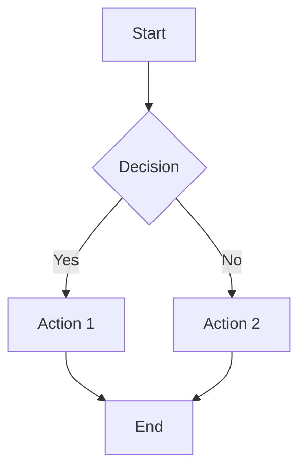

# md2x Usage Examples

This document provides practical examples and patterns for using md2x to convert Markdown files.

---

## Basic Conversions

### Convert to PDF (Default)
```bash
npx md2x README.md
# Output: README.pdf
```

### Convert to DOCX
```bash
npx md2x report.md -f docx
# Output: report.docx
```

### Convert to HTML
```bash
npx md2x article.md -f html
# Output: article.html
```

### Specify Output Path
```bash
npx md2x input.md -o /path/to/output.pdf
npx md2x input.md --output ~/Documents/report.pdf
```

---

## Theme Examples

### List Available Themes
```bash
npx md2x --list-themes
# Output:
# Available Themes:
#   - default
#   - academic
#   - minimal
#   - ...
```

### Use Academic Theme
```bash
npx md2x thesis.md --theme academic
npx md2x paper.md -t academic -f pdf
```

### Use Minimal Theme
```bash
npx md2x notes.md --theme minimal -f docx
```

---

## Page Break Control

### Enable Page Breaks (PDF/DOCX)
```bash
# Horizontal rules (---) become page breaks
npx md2x document.md --hr-page-break true
```

**Markdown Example:**
```markdown
# Chapter 1
Content for chapter 1...

---

# Chapter 2
Content for chapter 2...
```

### Disable Page Breaks
```bash
# Horizontal rules remain as visual dividers
npx md2x document.md --hr-page-break false
```

---

## HTML Diagram Modes

### Live Rendering (Default)
```bash
# Diagrams render in browser using CDN
npx md2x diagram.md -f html --diagram-mode live
```
- **Pros**: Interactive, always up-to-date
- **Cons**: Requires internet connection
- **Best for**: Online documentation, web publishing

### Pre-rendered Images
```bash
# Diagrams converted to embedded images
npx md2x diagram.md -f html --diagram-mode img
```
- **Pros**: Offline-ready, stable rendering
- **Cons**: Larger file size, not interactive
- **Best for**: Offline viewing, archival

### Source Code Only
```bash
# Keep diagram code blocks without rendering
npx md2x diagram.md -f html --diagram-mode none
```
- **Pros**: Smallest file size, fastest conversion
- **Cons**: No visual diagrams
- **Best for**: Code review, source inspection

---

## Front Matter Configuration

### Basic Front Matter
```markdown
---
format: pdf
theme: academic
---

# My Document
Content here...
```

### Complete Front Matter Example
```markdown
---
format: docx
theme: minimal
title: Project Report 2026
hrAsPageBreak: true
---

# Executive Summary
...
```

### Front Matter with CLI Override
```bash
# Front matter specifies theme: minimal
# CLI overrides with theme: academic
npx md2x input.md --theme academic
# Result: Uses academic theme
```

---

## Advanced Use Cases

### Convert Multiple Files
```bash
# Using shell loop
for file in *.md; do
  npx md2x "$file" -f pdf --theme academic
done
```

### Convert with Custom Output Directory
```bash
# Create output directory if needed
mkdir -p output
npx md2x input.md -o output/result.pdf
```

### Convert with Relative Paths
```bash
# From project root
npx md2x docs/README.md -o dist/documentation.pdf

# From subdirectory
cd docs
npx md2x README.md -o ../dist/documentation.pdf
```

### Generate Multiple Formats
```bash
# PDF, DOCX, and HTML from same source
npx md2x report.md -f pdf -o output/report.pdf
npx md2x report.md -f docx -o output/report.docx
npx md2x report.md -f html -o output/report.html
```

---

## Diagram Examples

### Mermaid Flowchart
```markdown
# Process Flow


```

### Graphviz DOT
```markdown
# System Architecture


```

### Vega-Lite Chart
```markdown
# Sales Data

```vega-lite
{
  "$schema": "https://vega.github.io/schema/vega-lite/v5.json",
  "data": {"values": [
    {"month": "Jan", "sales": 100},
    {"month": "Feb", "sales": 150},
    {"month": "Mar", "sales": 200}
  ]},
  "mark": "bar",
  "encoding": {
    "x": {"field": "month", "type": "ordinal"},
    "y": {"field": "sales", "type": "quantitative"}
  }
}
```
```

---

## Math Formula Examples

### Inline Math
```markdown
The equation $E = mc^2$ represents mass-energy equivalence.
```

### Block Math
```markdown
$$
\int_{-\infty}^{\infty} e^{-x^2} dx = \sqrt{\pi}
$$
```

---

## Troubleshooting Examples

### File Not Found
```bash
# ❌ Wrong
npx md2x nonexistent.md
# Error: Input file not found: /path/to/nonexistent.md

# ✅ Correct
npx md2x README.md
```

### Invalid Theme
```bash
# ❌ Wrong
npx md2x input.md --theme invalid-theme
# Error: Unknown theme: invalid-theme

# ✅ Correct - Check available themes first
npx md2x --list-themes
npx md2x input.md --theme academic
```

### Invalid Format
```bash
# ❌ Wrong
npx md2x input.md -f txt
# Error: Invalid format "txt". Must be "pdf", "docx", or "html".

# ✅ Correct
npx md2x input.md -f pdf
```

### Output Directory Creation
```bash
# Tool automatically creates directories
npx md2x input.md -o deep/nested/path/output.pdf
# Creates deep/nested/path/ if it doesn't exist
```

---

## Best Practices

### 1. Use Front Matter for Document Defaults
```markdown
---
format: pdf
theme: academic
title: Project Documentation
hrAsPageBreak: true
---
```
- Keeps conversion settings with the document
- Easy to version control
- CLI can still override when needed

### 2. Organize Output Files
```bash
# Keep source and output separate
npx md2x src/README.md -o dist/README.pdf
npx md2x docs/*.md -o output/
```

### 3. Choose Appropriate Diagram Mode
- **PDF/DOCX**: Diagrams always pre-rendered (no mode option)
- **HTML (online)**: Use `--diagram-mode live`
- **HTML (offline)**: Use `--diagram-mode img`
- **HTML (source review)**: Use `--diagram-mode none`

### 4. Theme Selection Guidelines
- **Academic**: Research papers, theses, formal reports
- **Minimal**: Clean documentation, technical specs
- **Default**: General purpose, balanced styling

### 5. Page Break Strategy
- **Enable** (`--hr-page-break true`): Multi-chapter documents, reports
- **Disable** (`--hr-page-break false`): Single-flow content, web articles

---

## Performance Tips

### 1. Batch Conversion
```bash
# Process multiple files efficiently
find docs -name "*.md" -exec npx md2x {} -f pdf \;
```

### 2. Skip Puppeteer Download
```bash
# Use system Chrome (faster install)
export PUPPETEER_SKIP_DOWNLOAD=1
export PUPPETEER_EXECUTABLE_PATH=/usr/bin/google-chrome
npx md2x input.md
```

### 3. Cache node_modules
```bash
# Install once, reuse for multiple conversions
npm install md2x
node_modules/.bin/md2x input.md
```

---

## Common Patterns

### Documentation Generation
```bash
# Generate docs from multiple sources
npx md2x README.md -o docs/overview.pdf
npx md2x API.md -o docs/api-reference.pdf --theme minimal
npx md2x CHANGELOG.md -o docs/changelog.pdf
```

### Report Creation
```bash
# Monthly report with academic theme
npx md2x reports/2026-01.md -f docx --theme academic -o reports/2026-01-report.docx
```

### Blog Post Export
```bash
# Export blog post to multiple formats
npx md2x blog/post.md -f html -o public/post.html
npx md2x blog/post.md -f pdf -o downloads/post.pdf
```

### Presentation Handouts
```bash
# Convert slides to PDF handout
npx md2x slides.md -o handout.pdf --hr-page-break true
```
